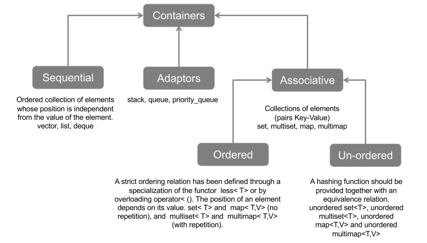
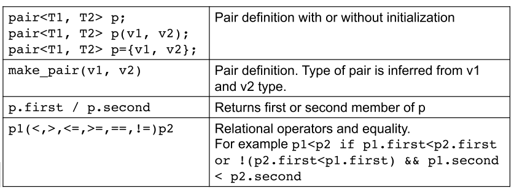
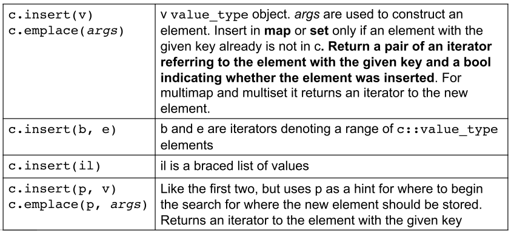
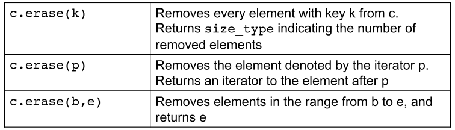
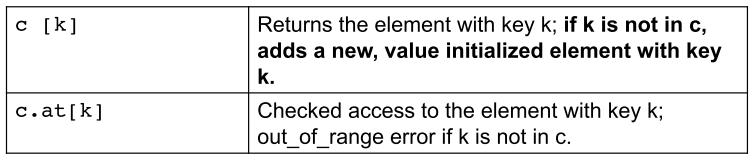
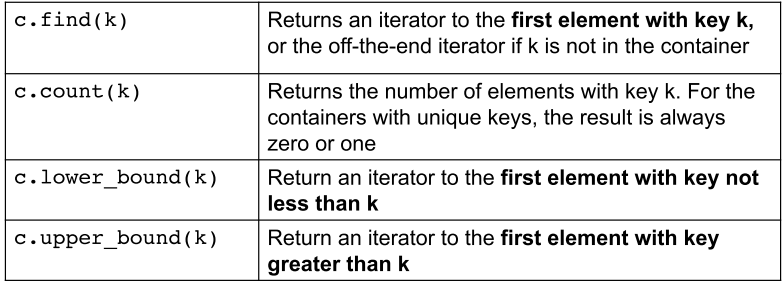
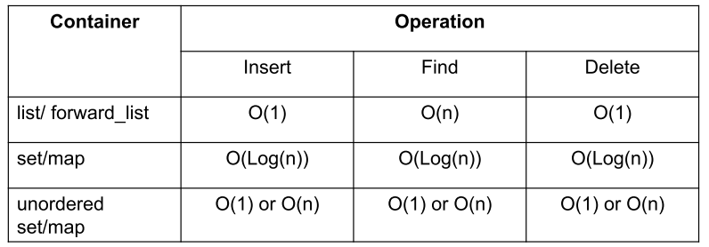

# **Algorithms and Parallel Computing - C++: Notes**

# **Lesson 13 - Standard Template Library, part 2**

## Sequential and Associative containers



- Elements in a sequential container are stored and accessed sequentially by their position in the container.
- Elements in an associative container are stored and retrieved by a key.

## ***CONTAINER ADAPTORS***

Container **adaptors** are interfaces created on top of a (limited) set of functionalities of a pre-existing sequential container.

When you declare the container adaptors, there's an option of specifying which sequential container to use as underlying container.

- `stack`
  - Last-In, First-Out (LIFO) access
  - Remove (`pop`) elements in the reverse order of insert (`push`) them; impossible to get any element in the middle
  - (Usually) On top of a `deque`
- `queue`
  - First-In, First-Out (FIFO) access
  - Remove (`pop`) elements in the same order of insert (`push`) them; impossible to get element in the middle but only `front` and `back`
  - (Usually) On top of a `deque`
- `priority_deque`
  - Sorted-order access to elements
  - Insert (`push`) elements in any order and then retrieve (`pop`) the "highest priority" of these values at any time
  - Use a *heap* structure internally, which in turn is basically **array-backed**. (Usually) On top of a `vector`

## ***ASSOCIATIVE CONTAINERS***

Associative containers support the general container operations. They do not support the sequential container position-specific operations, such as `push_front`.

They have:

- Type aliases
- Bidirectional iterators
- Specific operations
- Hash functions for the unordered version

## Overview of the Associative Containers

- `<map>`: `map` holds key-value pairs; `multimap` is a map in which one key can appear multiple times
- `<set>`: `set` is a container where the key is the value; `multiset` is a set in which one key can appear multiple times
- `<unordered-map>`: `unordered-map` is a map organised by a hash function; `unordered-multimap` is such that keys can appear multiple times
- `<unordered-set>`: `unordered-set` is a set organised by a hash function; `unordered-multiset` is such that keys can appear multiple times

## `std::map`

A `map` is a collection of `<key, value>` pairs with **unique keys**. It is referred to as **associative array**, which is like a "normal" array except that its *subscripts don't have to be integers*.

Values in a map are found by a key.

*EXAMPLE:* Given a map of names to phone numbers, we'd use a person's name as a subscript to fetch that person's phone number.

*EXAMPLE:*

```c++
map<string, size_t> word_count;                     // string is the key
string word;
while (cin >> word)
    ++word_count[word];								// example of using subscript operator with not an int, but the key
for (const auto &w : word_count)                    // reference to const: access but no modify
    ...
```

Implementation of a `map`: by a red-black trees, self-balancing binary search-tree. Insert and delete have complexity of O(log n) at worst case.

## `std::set`

A `set` is simply a collection of objects. It's most useful when we simply want to know whether a value is present.

*EXAMPLE:*

```c++
if (bad_checks.find("Mario") == bad_checks.end())   // .end() returns iterator referring to the past-the-end element
    cout << "Mario is okay";
else
    cout << "Mario is bad";
```

Implementation of a `set`: by a red-black trees, self-balancing binary search tree. Insert and delete have complexity of O(log n) at worst case.

So **insert and delete for an ordered set has complexity O(log n)**

## Associative vs. Sequential containers

The associative containers **do not support**:

- position-specific operations
- constructors or insert operations that take an element value and a count

The associative container **iterators** are always **bidirectional**.

## Requirements on key **type**

For the **ordered containers** (`map`, `set`) the **key type must define a way to compare the elements**; by default, the library uses the `<` to compare the keys. We can also supply our own `<` operation to use a strict weak ordering over the key type.

## The `pair` type

A `pair` is a **library type**, defined in the `utility` header, which *holds two data members*.

*EXAMPLE:*

```c++
pair<string, string> alfa;
pair<string, vector<int>> line;
```

**Elements in a map are `pair` type**; so, when we define a map by given (key, value)-tuple, we implicitly convert this tuple in pair.

The data members of `pair` are **public**, and are named `first` and `second`.



## Associative Container **Type Aliases**

- `key_type`: type of the key of the container
- `mapped_type`: type associated with each `map` key
- `value_type`: same as `key_type` for `set` and `pair<const key_type, mapped_type>` for `map`

*EXAMPLE:*

```c++
map<string, int>::key_type v4;              // v4 is a string
map<string, int>::mapped_type v5;           // v5 is a int
```

**Remember:** key is a `const`; `value_type` of a map is a pair and that we can change the value but not the key member of that pair. The keys in a `set` are also const, so we can use a `set` iterator to read but not to write an element's value.

## Iterating across an associative container

When we use an iterator to traverse a map, multimap, set or multiset, the iterators yield elements in **ascending key order**

## Adding/Erasing elements

Because (unordered) `map` and (unordered) `set` contain unique keys, inserting elements that are already present, has no effect.



*EXAMPLE:*

```c++
multimap<string, string> authors;
authors.insert({"Barth, John", "Lost in the Funhouse"});

// insert returns always only an iterator to the inserted element
```



`erase` works also for sequential containers.

## Subscripting a `map`

The `map` and `unordered_map` containers provide the **subscript operator** `[]` and a corresponding `at` function.

The `set` types **do not** support subscripting because there is no "value" associated with a key in a set (to use subscript, you need to know the key, which is already the value in a set).

It is **not possible** to subscript a `multimap` or a `multiset` because there may be more than one value associated with a given key



*EXAMPLE:*

```c++
map<string, size_t> word_count;
word_count["Anna"] = 1;

// the element is not found
// a new key-value pair is inserted
// the key is a const string "Anna"

// another way
word_count.insert(make_pair("Anna", 1));
```

## Accessing Elements



Lower and upper bound are **not valid** for unordered containers, in that case it's possible to rely on `equal_range`

## Unordered Associative Containers

- `unordered_map< , >`
- `unordered_set< , >`

**Collection of buckets**, each one containing a *variable* number of items.

Use of a **hash function** to map elements to buckets:

- given the **item key**, identify the proper bucket to store; **different keys with the same hash value are stored in the same bucket and originate a collision**
- all the elements with a given has value are stored in the same bucket
- all the elements with the same key will be in the same bucket

The performance depends on the quality of its hash function and on the number and size of its buckets.

These containers use a hash function and the **key type's** `==` **operator**.

use an unordered conainer if the key type is inherently unordered or if performane testing reveals problems that hashing might solve.

## Complexities of operations

Depending on what operations you need:

