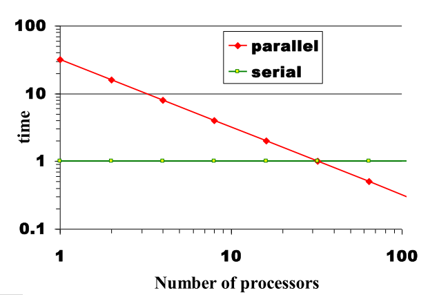
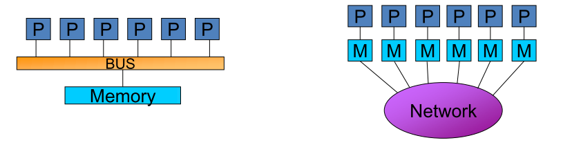

# **Algorithms and Parallel Computing - C++: Notes**

# Lesson 15 - Introduction to Parallel Computing

## What is Parallel Computing?

Use of multiple processing units working together on a common task.

- Each processing unit works on its section of the problem.
- Processing units are allowed to exchange information with other processing units.

*EXAMPLE:* Real life scenario

Assigning a set of books to workers is **task partitioning**. Passing of books to each other is an example of **communication** between subtasks.

Some problems may be completely serial.

## Types of parallelism: two extremes

1. **Data parallel**: same task on different data, *e.g.* big data problems, GPUs.
2. **Function parallel**: each processor performs a different function, *e.g.* signal processing.

Most applications fall somewhere on the continuum between these two extremes.

## Master-Worker parallelism

- A single processor is responsibe for distributing data and collecting results (function parallelism).
- All other processors perform the same task on their portion of data (data parallelism).

## Limits and problems of parallel computing

- Not all the algorithms can be parallelized.
- Theoretical upper limits: **Amdahl's law**.
- Practical limits: load balancing, non-computational sections (I/O, system ops, etc.).
- Different approach than sequential programming; it's needed to rethink the algorithms and to re-write code.

## Theoretical upper limits to performance

All parallel programs contain:
- Serial sections
- Parallel sections

Serial sections - when work is duplicated or no useful work done (*waiting for others*) - limit the parallel effectiveness. Lot of serial computation gives bad speedup, no serial work allows perfect speedup.

**Speedup** is the ratio of the time required to run a code on one processor to the time required to run the same code on multiple (N) processors; Ahmdahl's Law states this formally.

## Amdahl's Law

A strict limit on the speedup that can be realized by using multiple processors.

Effect of multiple processors on **run time**:

$$t_n = \displaystyle (\frac{f_p}{N} + f_s)t_1$$

Effect of multiple on **speed up**, defined as $S = \displaystyle \frac{t_1}{t_n}$

$$S = \displaystyle \frac{1}{f_s + \frac{f_p}{N}}$$

where:

- $f_s$ is the serial fraction of code
- $f_p$ is the parallel fraction of code
- $N$ is the number of processors
- $t_n$ is the time to run on N processors

Amdahls's law provides a theoretical upper limit on parallel speedup assuming that there are no parallelization overhead. In reality, **overhead** will result in a further degradation of performance.

## Sources of Parallel Overhead

1. **Interprocessor communication**: time to transfer data between processors
2. **Load imbalance**: in some parallel applications it is impossible to equally distribute the subtask workload to each processor.
3. **Extra computation**: sometimes the best sequential algorithm is not easily parallelizable and one is forced to use a parallel algorithm based on a poorer but easily parallelizable sequential algorithm.

## Serial performance

In this case, the parallel code achieves perfect scaling, but does not match the performance of the serial code untile 32 processors are used.

## S.L.O.W.

- **Starvation**: not enough work to do due to insufficient parallelism or poor load balancing among distributed resources.
- **Latency**: waiting for access to memory or other parts of the system.
- **Overhead**: extra work that has to be done to manage program concurrency and parallel resources.
- **Waiting for Contention**: delays due to fighting to use a shared resource.

## Superlinear speedup

In practice a speedup greater than N (on N processors). This is observed due to:

- nonoptimal sequential algorithm
- sequential problem may not fit in the processor's main memory and require slow secondary storage, whereas on multiple processors problem fits in main memory of N processors.

## Different approach than sequential programming

Writing effective parallel applications is difficult: communication can limit parallel efficiency, serial time can dominate, load balance is important.

**New paradigm**: real-time analysis vs batch jobs

Most small analyses are done in real time. Large jobs are typically done in a **batch model** (submit job to a queue, larger models, slow iterations, may need to wait).

## Parallel algorithms

Keep in mind that the algorithm should:

- need the minimum amount of communication
- balance the load among the processors equally

Use parallel libraries supplied whenever possible, and use *ScaLAPACK*,* PETSc*, etc. when applicable. Split problem into smaller "chunks"; "message passing" between processes.

## Single Program, Multiple Data (SPMD)

Dominant programming model; only a single source code is written; all copies of code are started simultaneously and communicate and synch with each other periodically.

*EXAMPLE:* Signal processing

Typical function parallel application. Use one processor for each task; can use more processors if one is overloaded.

## Accessing shared variables

If multiple processors want to write to a shared variable at the same time there may be conflicts.

Solution:

- Lock: mutual exclusive access to shared resources
- Deadlock risk:
  - Rb is not available for Pa, so the process enters into a waiting state
  - Ra is not available for pb, so the process enters into a waiting state
  - Both will be forever in waiting state
  - Deadlock arises when members of a group of processes that holds resources are blocked indefinitely from access to resources held by other processes within the group

*EXAMPLE:* Compute the sum of N variables

Sum of partial results for each processor, while each processor computes the sum of a fraction of the numbers; local variables such that each processor owns a private copy.

The first processor does the final summation. This is inefficient, because the last step is not shared (serial component).

Let's parallelize the last step. Optimal solution: partial sms are added in parallel by some of the processors (in $log_2 N$ steps)

## ***PARALLEL MACHINES***

## Processor Related Terms

- FLOPS: floating point operation per second
- PIPELINE: technique where multiple instructions are overlapped in execution
- SUPERSCALAR: multiple instructions per clock period
- CACHE: fast memory (SRAM) near the processor; helps keep instructions and data close to functional units so processor can execute more instructions more rapidly

Pipelining overlaps various stages of instruction execution to achieve better performance. An instruction can be executed while the next one is being decoded and the next one is being fetched.

## Simultaneous Multi-Threading

The same set of hardware components can be shared among several execution pipelines (multiplexing, virtualization).

Usually a processor can execute two hardware threads in parallel; improvement in performance is due to the possibility of running another thread while one is stopped by a memory lock.

## Many-core

Many-core architectures supports a (usually large) number of (simple) cores in a single processor package; cores can be symmetric or asymmetric.

The goal is to achieve high throughput due to parallelization, rather than speed in single operations.

Usually integrated to speed-up computation for 3D graphics.

## Shared and Distributed memory

- **Shared memory**: single address space. All processors have access to a pool of shared memory. Processor-to-processor data transfers are done using shared areas in memory. **Bus** is one method of memory access.
  - *Uniform memory access* (UMA)
  - *Non-uniform memory access* (NUMA)
- **Distributed memory**: each processor has its *own local* memory. Must do *message passing* to exchange data between processors.

## UMA

Memory access problems:

- Systems do not scale well
- Cache coherence problem

Programming methodologies:

- Standard Fortran or C
- Threads like methods

## NUMA

Memory access problems:

- Similar cache problems
- Attention to data distribution (load balance)

Programming methodologies: same as UMA

## Distributed Memory

Programming methodologies: mostly message passing using **MPI**
