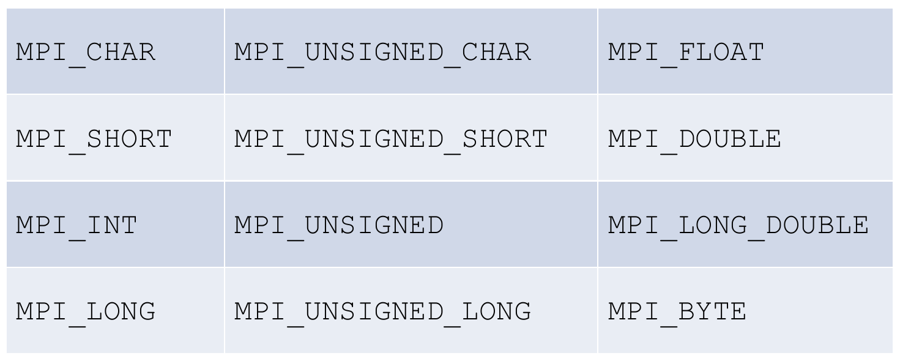

# **Algorithms and Parallel Computing - C++: Notes**

# **Lesson 17 - Message Passing Interface, Part 1**

## ***PARALLEL PROGRAMMING WITH MPI***

## What is MPI?

MPI is an **interface specification**; basically, a document stating the functionality that vendors should provide and users rely upon.

The goal is a portable, flexible, efficient and practical **message passing** interface standard. Our focus is on **Open MPI**.

## Programming Model

In MPI all parallelism is **explicit**. So it's important to identify what should be parallelized and how is on programmers.

MPI was designed for **distributed memory** architectures, even if the implementations currently support any common parallel architecture.

## Message Passing Basic Idea

A program running on one core is usually called a **process**.

Two processes can communicate by calling functions:

- one process calls a **send function**
- the other process calls a **receive function**

MPI supports also **global communication** functions that can involve more than two processes. These functions are called **collective communications**.

## ***PRELIMINARIES: PASSING PARAMETERS TO C++***

## Passing arguments to `main`

Pass values from the command line to C/C++ programs when they are executed: **command line arguments**. This is important when you want to control your program from outside. The command line arguments are handled using `main()` function arguments:

- `argc` refers to the **number** of arguments passed
- `argv[]` is an **array of pointers** which point to each argument passed to the program

Each argument is represented as a C c`har[]`. hence **argv[] type is `char*`**

```c++
#include <iostream>

int main(int argc, char* argv[])
{
    ...
}
```

## Compiling C++ Program

` g++ --std=c++11 file_name`: it generates a file called as default `a.out`

`g++ --std=c++11 file_nema -o executable_file` {?A?A?A}

## Executing at command line

`./a.out arguments_supplied`

It should be noted that:

- `argv[0]` is a pointer to the name of the program itself
- `argv[1]` is a pointer to the first command line argument supplied
- `*argv[argc - 1]` is the last argument

If, *e.g.*, no arguments are supplied, `argc` will be 1, and if you pass one argument, `argc` is set at 2.

## ***MPI BASICS***

*EXAMPLE:*

```c++
#include<cstdio>                            // C library for I/O
#include<mpi.h>                             // MPI library

int main (int argc, char * argv[])
{
    MPI_Init (&argc, &argv);                // setup MPI system
    int rank, size;
    MPI_comm_size (MPI_COMM_WORLD, &size);  // compute dimension of global communicator (total number of processes) and assign to size
    MPI_comm_rank (MPI_COMM_WORLD, &rank);  // rank from 0 to size-1
    printf("Hello from process %d of %d \n", rank, size);
    MPI_Finalize ();                        // finished using MPI, free resources allocated
}
```

## Compile and Run MPI

- **Compile**: `mpicxx -o exe file1.cc [file2.cc ...]` (compiler -o executable_name source_files.cc); all the flags are the same with `g++`, so, *e.g.* `--std=c++11` works
- **Run**: `mpiexec -np 4 exe`

## `MPI_Init` and `MPI_Finalize`

Declarations:

```c++
int MPI_Init (int * argc_p, char *** argv_p)
```

The arguments are pointers to the arguments to `main`, `argc` and `argv` (which is an array of pointers). When our program doesn't use these arguments, we can just pass `nullptr` for both.

Like most MPI functions, `MPI_Init` returns an `int` *error code* (in most case we'll ignore these error codes).

```c++
int MPI_Finalize (void)
```

`MPI_Finalize` tells the MPI system that we're done using MPI, and that any resources allocated for MPI can be freed. No MPI functions should be called after.

## MPI programs general structure

```c++
...
#include<mpi.h>
...
int main(int argc, char * argv[])
{
    ...
    MPI_Init(&argc, &argv);
    ...
    MPI_Finalize();
    ...
    return 0;
}
```

## ***POINT TO POINT COMMUNICATION***

## Communicators

MPI processes can be addressed via **communicators**, a sort of net of processors. A **communicator** is a collection (*i.e.*, a subset) of processes that can send messages to each other (each process runs on a single processor).

One communicator is predefined and collects each and every process created when launching the program: `MPI_COMM_WORLD`.

**Point to point** means that you explicitly state which among the communicator's processes you want to reach.

## Ranks and Size

A communicator **size** is the number of processes it collects and allows to reach.

Every process is identified within a communicator by means of a **rank**, a unique integer in `[0, size)`.

Declarations:

```c++
int MPI_Comm_size (MPI_Comm comm, int * size)

int MPI_Comm_rank (MPI_Comm comm, int * rank)
```

The first argument is a communicator and has the special type defined by MPI for communicators, `MPI_Comm`.

`MPI_Comm_size` returns in its second argument the number of processes in the communicator.

`MPI_Comm_rank` returns in its second argument the calling process rank in the communicator.

*EXAMPLE:*  "Hello, world!"

```c++
std::ostringstream builder;
builder << "Hello from " << rank << " of " << size;
std::string message (builder.str());
if (rank > 0)
    MPI_Send (&message[0], max_string, MPI_CHAR,
            0, 0, MPI_COMM_WORLD);
else 
{
    std::cout << message << std::endl;
    for (int r = 1; r < size; ++r)
    {
        MPI_Recv (&message[0], max_string, MPI_CHAR, r, 0, 
                MPI_COMM_WORLD, MPI_STATUS_IGNORE);
        std::cout << message << std::endl;
    }
}
```

## MPI_Send

```c++
int MPI_Send (const void * buf, int count, MPI_Datatype datatype,
              int dest, int tag, MPI_Comm comm)
```

The first three arguments determine the contents of the message; the remaining arguments determine the destination of the message.

Remember that `void *` indicates a **universal pointer**, *i.e.*, the pointer can point to any variable that is not declared with the **const** (or **volatile**) keyword. A `void *`pointer can't be dereferenced unless it is cast to another type. It can be converted into any other type of data pointer.

*EXAMPLE:*

```c++
MPI_Send (&message[0], max_string, MPI_CHAR, 0, 0, MPI_COMM_WORLD0);
```

## MPI_Recv

```c++
int MPI_Recv (void * buf, int count, MPI_Datatype datatype,
              int source, int tag, MPI_Comm comm, MPI_Status * status)
```

*EXAMPLE:*

```c++
MPI_Recv (&message[0], max_string, MPI_CHAR, r, 0, MPI_COMM_WORLD, MPI_STATUS_IGNORE);
```

## Point to point arguments

- `buf` is the **array** storing the data to send or ready to receive data
- `count` states **how many replicas of the data type will be sent**, *or* the **maximum allowed in when sending/receiving** (in the previous examples of send and receive, this was the case).
- `source` and `dest` are ranks identifying the target sender or receiver
- `tag` is used to distinguish messages travelling on the same connection. Advanced feature, it won't be used.
- `status`: detailed information on received data; in many cases it won't use.

## Data types



## `tag`

`tag` is a non-negative `int`. It can be used to **distinguish messages that are otherwise identical**.

## Message Matching

- Process *q*: `MPI_Send (send_buf, send_count, send_datatype, dest, send_tag, send_comm);`
- Process *r*: `MPI_Recv (recv_buf, recv_count, recv_datatype, srce, recv_tag, recv_comm, &status);`

The message sent by *q* CAN be received by *r* **if**:

1. `send_comm = recv_comm`
2. `dest = r`
3. `srce = q`
4. `recv_tag = send_tag`
5. `recv_datatype = send_datatype`
6. `recv_count >= send_count`

## Non-overtaking messages

If process *q* sends two messages to process *r*, then the first message sent by *q* must be available to *r* before the second message.

There is **no restriction on the arrival of messages sent from different processes**: if *q* and *t* both send messages to *r*, then even if *q* sends its message before *t* sends its message, there is no guarantee that *q*'s message become available to *r* before *t*'s message.

## Deadlocks

Deadlocks occur when processes block communication, but their requests remain unmatched or unprocessed.

## Process Hang

If a process tries to receive a message and there's **no matching send**, then the process will **block forever**. When you design your programs, be sure that every receive has a matching send.

If tags of `MPI_Send` and `MPI_Recv` don't match, or if the rank of the destination process is the same as the rank of the source process (so point 6 is not satisfied), the receive won't match the send.

## MPI OUTPUT

In "Hello world", process 0 writes to the standart output. **MPI standard doesn't specify which processes have access to which I/O devices**. To have "sorted output", the *common practice* is each process sends its output to process 0, and process 0 can print the output in process rank.

## MPI INPUT

Unlike output, **most MPI implementations only allow process 0 in MPI_COMM_WORLD access to standard input**. The common practice is that process - performs `std::cin` and then it **broadcasts** input values to all processes.