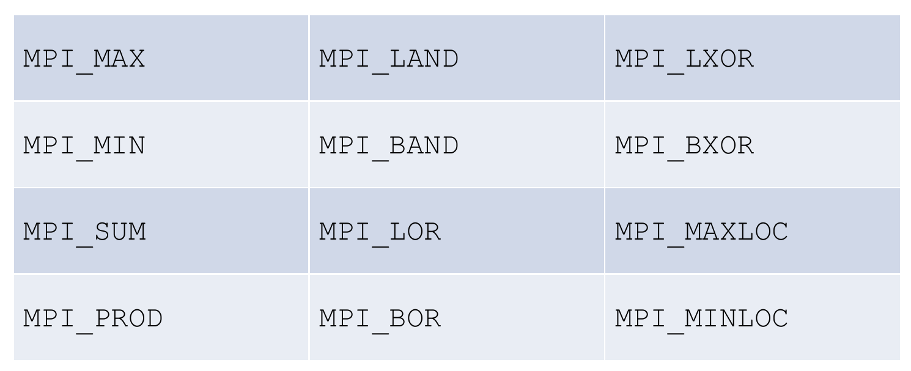

# **Algorithms and Parallel Computing - C++: Notes**

# **Lesson 18 - Message Passing Interface, Part 2**

## ***COLLECTIVE COMMUNICATION***

## Collective Routines

- Involve **all the processes** in a communicator
- Blocking routines only
- Transmit **only predefined MPI data types**
- **Can't use tags** to identify messages
- Be sure that every process in the communicator calls the collective function to avoid deadlocks

## Broadcast

```c++
int MPI_Bcast (void * buffer, int count, MPI_Datatype datatype,
                           int root, MPI_Comm comm)
```

Delivers an **exact copy** of the data in `buffer` from `root` to all the processes in communicator `comm`

## Reduce

```c++
int MPI_Reduce (const void * sendbuf, void * recvbuf, int count, MPI_Datatype datatype,
                             MPI_Op op, int dest, MPI_Comm comm)
```

Applies an MPI operator (`op`) to portions of data in `sendbuf` from all the processes in `comm`, storing the result in `recvbuf` on `dest` rank.

*EXAMPLE:*

```c++
double local_partial = ... ;
double total;
MPI_Reduce (&local_partial, &total, 1, MPI_DOUBLE, MPI_SUM, 0, MPI_COMM_WORLD);
```

## Reduce Operators



By using a **count argument** **greater** than 1, `MPI_Reduce` can **operate on arrays instead of scalars**

## Allreduce

In some situations (*e.g.*, implementing a **parallel function**) **all of the processes** might need the result of a global sum in order to complete some larger computation. MPI provides a variant of `MPI_Reduce` that will **store the result on all the processes**

```c++
int MPI_Allreduce (const void * sendbuff, void * recvbuff, int count,
                                  MPI_Datatype datatype, MPI_Op op, MPI_Comm comm))
```

## Collective communication "In Place"

Collective communication routines generally use both a send and a receive buffer. When dealing with lots of data this implies occupying memory.

MPI provides the special **placeholder** `MPI_IN_PLACE` to enable the use of a single buffer for both input and output

*EXAMPLE:*

```c++
std::pair<double, int> minimum (local_min, rank);
MPI_Allreduce (MPI_IN_PLACE, &minimum, 1, MPI_DOUBLE_INT,
               MPI_MINLOC, MPI_COMM_WORLD;
```

It might be tempting to call `MPI_Reduce` using the same buffer for both input and output:

*EXAMPLE:*

```c++
MPI_Reduce (&x, &x, 1, MPI_DOUBLE, MPI_SUM, 0, comm);
```

This call is **illegal** (*undefined behaviour*), its result will be unpredictable. This because it involves **aliasing** of an output argument: two arguments are aliased if they refer to the same block of memory..

## Data distributions

- **block partition**: used when data source is available on a single process.


- **cyclic partition**: used when data source is already available across all processes.


## Scatter

Let's suppose we want to implement a vector addition function; in order to do that, we need to read the dimension of the vectors and then read in the vectors.

Process 0 can prompt the user, read in the dimension and broadcast the value to other process.

For the vectors, process 0 reads them (no other option) and sends the needed components to each of the other processes. This is exactly what `MPI_Scatter` implements, via **block partition scheme**.

```c++
int MPI_Scatter (const void * sendbuf, int sendcount, MPI_Datatype sendtype,
                       void * recvbuf, int recvcount, MPI_Datatype recvtype,
                 int root, MPI_Comm comm))
```

It **sends a portion** of the data in `sendbuf` from `root` to all the processes in `comm`, storing it in `recvbuf`.

## Gather

```c++
int MPI_Gather (const void * sendbuf, int sendcount, MPI_Datatype sendtype,
                      void * recvbuf, int recvcount, MPI_Datatype recvtype,
                int root, MPI_Comm comm)
```

It joins portions of data in `sendbuf` from all the processes in `comm` to `root`, storing them all in `recevbuf`.

## Final remarks

- All the processes in the communicator must call the same collective function. If a program attempts to match a call to `MPI_Reduce` on another process it is erroneous and probably will hang or crash.
- The arguments passed by each process to an MPI collective communication must be "compatible". If one process passes in 0 as the `dest` process and another passes in 1, then the outcome of a call to `MPI_Reduce` is erroneous and the program is likely to hang or crash.
- The `recvbuf` argument is only used on `dest` process. However, all of the processes still need to pass in an actual argument corresponding to `recvbuf`, even if it's just `nullptr`.
- Point-to-point communications are matched based on tags and communicators. Collective communications don't use tags, so they're matched solely based on the communicator and the order in which they are called.

*See also:*

[Open MPI Documentation](https://www.open-mpi.org/doc/current)

[MPI Tutorial by Lawrence Livermore National Laboratory](https://computing.llnl.gov/tutorials/mpi/)