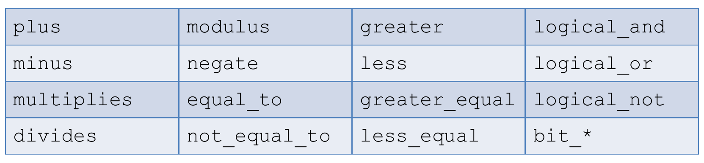

# **Algorithms and Parallel Computing - C++: Notes**

# **Lesson 20 - Functional C++**

## ***FUNCTIONS AS VALUES***

Several algorithms should logically receive functions as parameters, they are *higher order functions*, *e.g.* optimization techiniques, equation solvers, numerical integration, differentiation.

Yet, C++ **does not** provide any primitive type to represent functions.

## ***CALLABLE OBJECTS***

A way to work around this limitation is defining **callable objects**.

When you implement a public `operator ()`, the class becomes callable.

## Properly using Callable Objects

`<functional>` helps in declaring generic higher order functions.

*EXAMPLE:*

```c++
// NO working

unsigned count_if (is_small const & f, std::vector<int> const & v)

unsigned small_no = count_if(is_small(), my_vector);
unsigned large_no = count_if(is_large(), my_vector);                            // NO, need new overload

// YES working

unsigned count_if (std::function<bool(int)> const & f, std::vector<int> const & v)

unsigned small_no = count_if(is_small(), my_vector);
unsigned large_no = count_if(is_large(), my_vector);                            // OK
```

`<functional>` defines several callable class templates. Most operators have an equivalent **function object**:



*EXAMPLE:* Sum operation

```c++
// "normal" definition
double sum (std::vector<double> const & values) {
    double result(0.0);
    for (double v : values)
        result = result + v;
    return result;
}

// with callable object
double sum (std::vector<double> const & values) {
    double result(0.0);
    std::plus<double> op;                                                       // note the plus<double>
    for (double v : values)
        result = op(result, v);
    return result;
}

aaaa
```