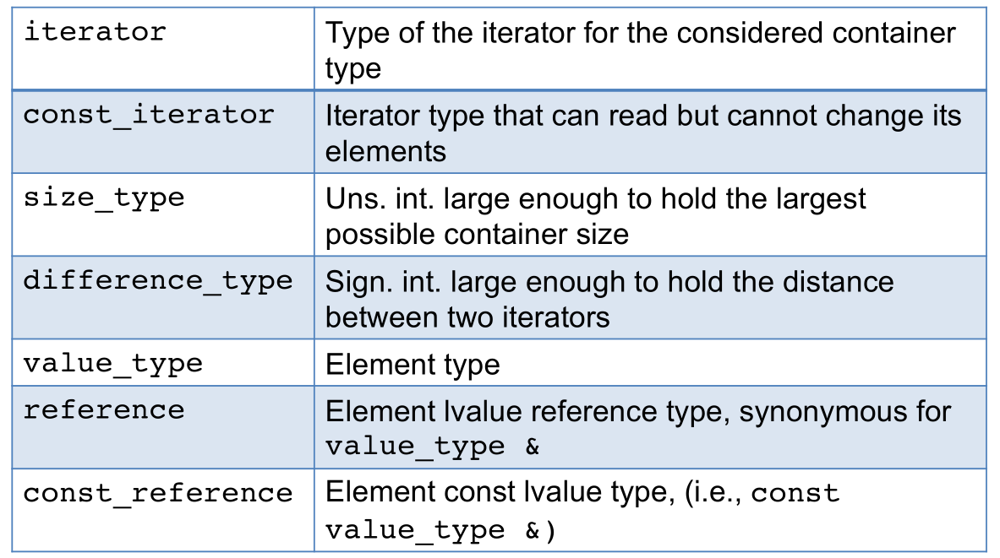

# **Algorithms and Parallel Computing - C++: Notes**

# **Lesson 11 - Standard Template Library, part 1**

STL is a software library for the C++ that provides four components:

- **algorithms**
- **containers**
- **functional** (or functor)
- **iterators**

STL provides a ready-made set of common classes for C++, such as containers and associative arrays, that can be used with any *built-in* type and with any *user-defined* type that supports **copying** and **assignment** (which are synthetized for us by the compiler if we don't define).

Containers implement a **like-a-value semantic**.

**Container elements are copies**: when we use an object to initialize a container, or insert an object into a container, **a copy of that object value is placed in the container**, not the object itself.

Algorithms are **independent** of containers, reducing complexity of the library.

STL achieves its results through the use of **templates**: *compile-time polymorphism* that is often more efficient than traditional run-time polymorphism.

## STL - Container Classes

Container classes share a **common interface** (public part), which every container extends in its own way.

Each container has different performance and functionality trade-offs.

- **SEQUENTIAL CONTAINERS**:
  - Control the order of store and access.
  - This order depends on the position of the elements.
- **ASSOCIATIVE CONTAINERS**: *ORDERED* and *UNORDERED*
  - Store based on the value of a key.
  - Elements retrieved efficiently according to their key value.

## Sequential Containers

1. **fast sequential access**
2. performance trade-offs:
   - **add/delete** elements
   - **non-sequential access**

- `vector`: flexible-size array. Supports **fast random** (so non-sequential) **access**. Slow add/delete elements, except **fast add/delete at back**.
- `deque`: double-ended queue. Supports **fast random access**. **Fast add/delete at front and at back**.
- `list`: double linked list. Supports **bidirectional sequential access**. **Fast add/delete at any point**.
- `forward_list`: single linked list. Supports **sequential access** in one direction. **Fast add/delete at any point**.
- `array`: fixed-size array. Supports **fast random access**. **Not allowed add/delete**.
- `string`: specialized container (characters only), similar to vector. **Fast random access**. **Fast add/delete at back**.

## How are `vector`s implemented?

    class vector {
        private:
            unsigned sz;
            double* elem;
        public:
            vector(unsigned s): size(s), elem{new double[s]} {}
            ~vector() { delete[] elem; }

            double get(unsigned n) const { return elem[n]; }        // access: read
            void set(unsigned n, double v) { elem[n] = v; }         // access: write
            unsigned size() { return sz; }
    };

## ACCESS

Let's define the operator of assignment for vector (note, in the example, the `[]` is applied on built-in arrays)

1. via *pointer*

        class vector {
            ...
            public:
                double* operator[] (unsigned n) { return &elem[n]; }
            ...
        };

        vector v(10);
        for (unsigned i = 0; i < v.size(); ++i) {
            *v[i] = i;                                  //  derefence operator, because v[i] returns a pointer
        }

2. via *reference*

        class vector {
            ...
            public:
                double& operator[] (unsigned n) { return elem[n]; }
            ...
        };

        for (unsigned i = 0; i < v.size(); ++i) {
            v[i] = i;
        }

## Changing `vector` size

Three methods:

1. Add an element: `v.push_back(i)`
2. Resize it: `v.resize(k)`
3. Assign to it: `v = v2`

## Representing a vector

If you `resize` or `push_back`, it's good to keep a bit of free space for future expansion:

    class vector {
        private:
            unsigned sz;
            double* elem;
            unsigned space;             // number of elements plus "free space"
        public:
            ...
    };

## How a `vector` grows

To *support fast random access*, vector elements are **stored contiguously**. 

If there is no room for the new element:

1. the container must allocate new memory;
2. move the elements from the old location into the new space;
3. add the new element;
4. deallocate the old memory.

When they have to get new memory, vector and string implementations typically **allocate capacity beyond** what is immediately **needed**.

## `vector::reserve()`

It doesn't mess with size or element values.

    void vector::reserve(unsigned newalloc) 
    {
        // make the vector have space for newalloc elements

        if (newalloc <= space) return;
        double* p = new double[newalloc];
        for (unsigned i = 0; i < sz; ++i)
            p[i] = elem[i];
        delete[] elem;
        elem = p;
        space = newalloc;
    }

Algorithm Complexity: **O(sz)**

## `vector::resize()`

Given `reserve`, `resize` is easy:

- `reserve` deals with space/allocation
- `resize` deals with element values

        void vector::resize(unsigned newsize; double t = 0.0)
        {
            // make the vector have newsize elements

            reserve(newsize);
            for (unsigned i = sz; i < newsize; ++i)
                elem[i] = t;
            sz = newsize;
        }

Algorithm Complexity: **O(newsize)**

## `vector::push_back()`

    void vector::push_back(double d)
    {
        // increase vector size by one, initilialize new element with d

        if (sz == 0)                    // no space: grab some
            reserve(8);
        else if(sz == space)
            reserve(2*space;)
        elem[sz] = d;
        ++sz;
    }

Algorithm Complexity: **O(space)**

## Range checking

STL doesn't guarantee range checking, because checking costs in speed and code size.

## ***SEQUENTIAL CONTAINERS***

Provide efficient, flexible memory management: we can add and remove elements, grow and shrink the size of the container (with exception of array, fixed-size container).

The strategies of storing impact on the efficiency of the operations.

- `list` implements a **doubly-linked list**
- `forward_list` implements a **singly-linked list**

`list` and `forward_list` are designed to make it fast to add or remove an element anywhere in the container; in exchange, they don't support random access to elements; only **access from begin to the end**. Memory **overhead** (additional space reserved) is significant. No `size` operation.

`deque` is a more complicated data structure: like `string` and `vector`, it supports fast random access; adding/removing elements in the middle of a deque is an expensive operation; adding/removing elements at either front or end is a fast operation.

`array` is a safer, easier-to-use **alternative** to built-in arrays and has fixed-size.

## Which Sequential Container to Use?

- If you need lots of small elements and space overhead matters, **don't** use `list` or `forward_list`.
- If the program requires random access to elements, use a `vector` or a `deque`.
- If the program needs to insert or delete elements in the middle of the container, use a `list` or `forward_list`.
- If the program needs to insert or delete elements at the front **and** the back, but not in the middle, use a `deque`.
- If the program needs to insert elements in the middle of the container only while reading input and subsequently needs random access to the elements:
  - is it needed to add elements in the middle? You can also use vector and then sort function to reorder.
  - if you must insert into the middle, use `list` for the input phase, then copy into a `vector`.
- If the program needs random access and needs to insert and delete elements in the middle, evaluate between `list`/`forward_list` and `vector`/`deque`.
- If **not sure** which to use, write using *only operations common to both vectors and lists*: **use iterators, not subscript** and **avoid random access** to elements.

## Container common types

## Container common operations

## Creating a container

Each container is defined in a header file; **containers are class templates**. Almost any type can be used as the element type of a sequential container, *e.g.*`vector<vector<string>> lines`.

## Iterators

Iterators have also a common interface: they let access an element from a container providing the dereference operator (`*`) and allow to move from one element to the next through the increment operator.

Note: `forward_list` iterators do not support decrement operator `--`.

Note: these operatrions apply only to iterators `string`, `vector`, `deque`, `array`, **not for** `list`, `forward_list`.

## Iterators Ranges

Left-inclusive interval: **[begin, end)**

**Reverse Iterators**: iterator that goes backward.

## Assignment operator

The assignment operator replaces the entire range of elements in the left-hand container with **copier** of the elements from the right-hand operand. After an assignment, the left- and right-hand containers are equal.

## Using `swap`

Exchanges the contents of two containers of the same type, no need of the same size.

With the exception of arrays, swapping two containers is guaranteed to be fast; the elements themselves are not swapped, the internal data structures are swapped; complexity O(1).

Swapping two arrays does exchange the elements; complexity O(N).

**Pointers invalidation and `swap`**: the fact that elements are not moved means that **iterators, references and pointers** into the containers **are not invalidated**: they refer to the same elements as they did before the swap; after the swap, those elements are in a different container.

Differently from the containers, a call to **swap on a string may invalidate iterators, references and pointers**.

In C++ 11, both a **member** (`c1.swap(c2)`) and **non-member** (`swap(c1,c2)`) version of swap. Best to use the non-member version.

## Container Size Operations

- `size()`: not available for `forward_list()`.
- `empty()`: returns a bool.
- `max_size()`.

## Relational Operators

All the containers except the unordered associative containers (the ones with hash function) also support the relational operators. 

*The right-hand and left-hand operands must be the same kind of container and must hold elements of the same type*.

Comparing two containers performs a pairwise comparison of the elements:

- if both containers are the same size and all the elements are equal, then the two containers are equal; otherwise, they are unequal.
- if the containers have different sizes but every element of the smaller one is equal to the corresponding element of the larger one, then the smaller one is less than the other.
- if neither container is an intial subsequence of the other, then the comparison depends on comparing the first unequal elements.

**Relational operators use their element relational operator**.

If the element type doesn't support the required operator, then we can't use the corresponding operations on containers holding that type.

Instead of relying on `==`, you can use the `equal` function defined within the STL header `algorithm`.

## Adding elements to a sequential container

Excepting array, all of the library containers provide flexible memory management.

Adding elements to a `vector` or a `string` may cause the entire obect to be reallocated.

## `deque`

- Organizes data in chunks of memory referred by a sequence of pointers.
- Like `vector` offers fast random access to its elements, provides the `push_front` member even though vector does not.
- Guarantees *constant-time insert and delete* of elements at the beginning and end of the container.
- Inserting elements other than at front or back is expensive operation.

## Adding elements at a specified point in the container

`insert` members: let us zero or more elements at any point in the container.

## Accessing elements

(`c[n]` is the subscript operator)

The access members return references.

## Erasing elements

## The `pop_front` and `pop_back` members

Remve the first and last elements, returning `void`.

- No `pop_front` for `vector` and `string`.
- No `pop_back` for `forward_list`.

## Resizing a container

## Warning

Container operations may invalidate iterators! Operations that add or remove elements from a container can *invalidate* pointers, references or iterators to container elements.

After an operation that adds elements to a container:

- iterators, pointers, references to a `vector` or `string` are invalid **if the container was reallocated**.
- iterators, pointers, references to a `deque` are invalid **if we add elements anywhere but at the front or back**.
- **if we add at the front or back, iterators are invalidated, but references and pointers to existing elements are not**.
- iterators, pointers, references (including the off-the-end and the before-the-beginning iterators) to a `list` or `forward_list` remain invalid.